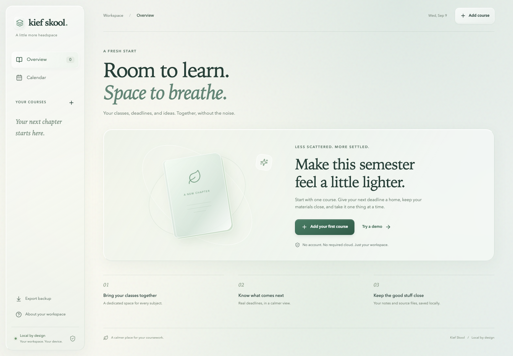

# Kief Skool

Your classes, deadlines, and study materials. On your computer.

Kief Skool is a local student planner with a liquid-glass interface. Add your own classes, see what is due next, save original syllabi and class materials, and mark work complete. No account is required. Your documents stay on your computer unless you explicitly use the optional online tutor.



## Install on a Mac

**First:** install [Node.js](https://nodejs.org/en/download) 22.12 or later if you do not already have it. The installer checks this and explains what is missing. Works with Apple Silicon and Intel macOS; no sudo or GitHub login required.

Open Terminal and run:

```bash
curl -fsSL https://raw.githubusercontent.com/basedagent/kief-skool-downloads/main/install.sh | bash
```

Then launch:

```bash
~/.local/bin/kief-skool start --open
```

If `~/.local/bin` is on your PATH, you can use `kief-skool start --open`. Keep the terminal running while you use the app. **Ctrl-C** stops the app.

This opens http://127.0.0.1:4311 in your browser. No hosted account, database setup, API key, Codex installation, or terminal course setup is needed.

### Prefer to inspect the installer first?

The one-line command executes downloaded code. Download and review it before running:

```bash
curl -fsSL https://raw.githubusercontent.com/basedagent/kief-skool-downloads/main/install.sh -o /tmp/kief-skool-install.sh
less /tmp/kief-skool-install.sh
bash /tmp/kief-skool-install.sh
```

The installer checks the versioned archive's SHA-256 before installation. It installs only under your user-owned `.local` directory, leaving your existing classes separate from application versions.

## Set up your semester

1. Click **Add a course** and enter your class title, code, term, and timezone.
2. Add a deadline from your syllabus.
3. Import your syllabus or notes from the course workspace.
4. Return to Home to see your next deadline and mark finished work complete.

You can try a clearly labeled synthetic demo first. The download never includes another student's class records or documents. A local profile is optional and does not require email verification.

## Privacy

Data on a Mac lives at `~/Library/Application Support/Kief Skool/`. Uploaded files are copied locally, with a hash and import timestamp. Automatic text extraction is optional; importing a syllabus does not invent or confirm deadlines. A PDF stays available even if text extraction is unavailable.

The core planner works offline while its local service is running. Optional tutoring uses a separately installed/authenticated Codex CLI and sends relevant excerpts and questions to the model provider when you request help. You do not need it to use the planner.

Use **Export backup** in the app, or stop the app and back up the entire data directory. Keep backups private. Uninstalling the program preserves student data. The app is a single-user local service; do not expose its port to an untrusted network.

## Useful commands

```bash
kief-skool start --open --port 4320
kief-skool status
kief-skool doctor
kief-skool upgrade
kief-skool uninstall --yes
```

The app runs in the foreground. Stop it with Ctrl-C before upgrading. Upgrade installs a newer published version; trying to install a version already present leaves it unchanged.

## Downloads

See [versioned releases](https://github.com/basedagent/kief-skool-downloads/releases) for archives and checksums. This repository is the public distribution channel. The development repository is private. Release packages include the generic runtime code, but no private class files or development history.

## Current limits

macOS is the tested installer target. Node.js 22.12+ and npm are prerequisites. This is a local browser app, not a signed native desktop app. Cloud sync, LMS integrations, automated authoritative syllabus parsing, and a backup restore wizard are not included. No user tracking or cloud account is required.
